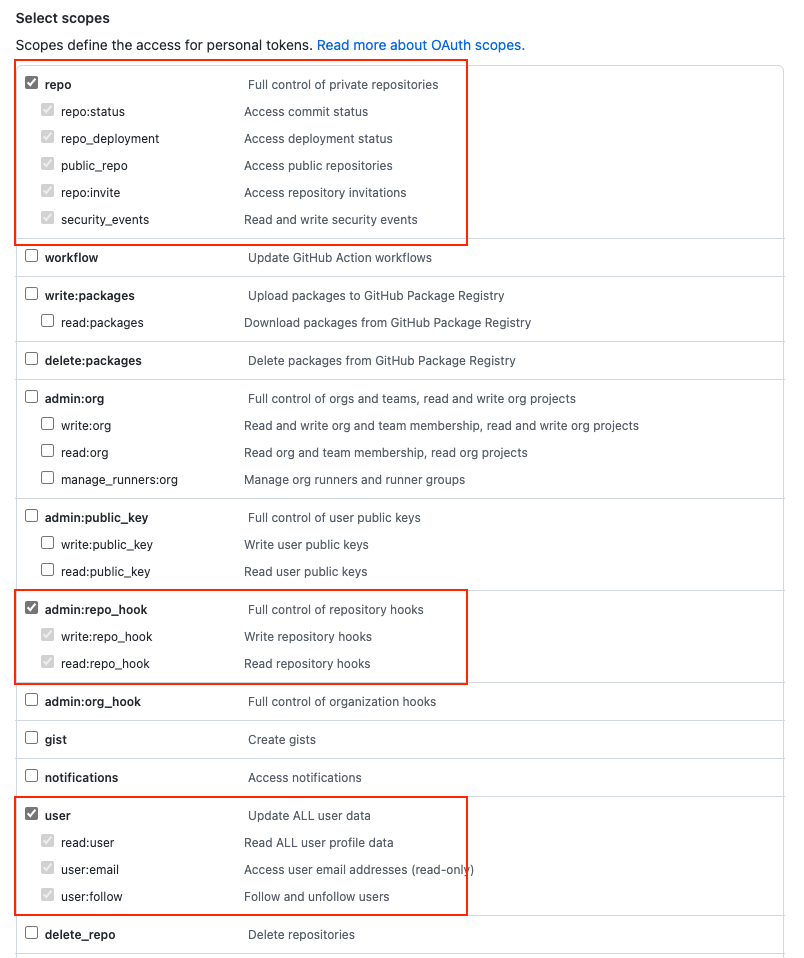
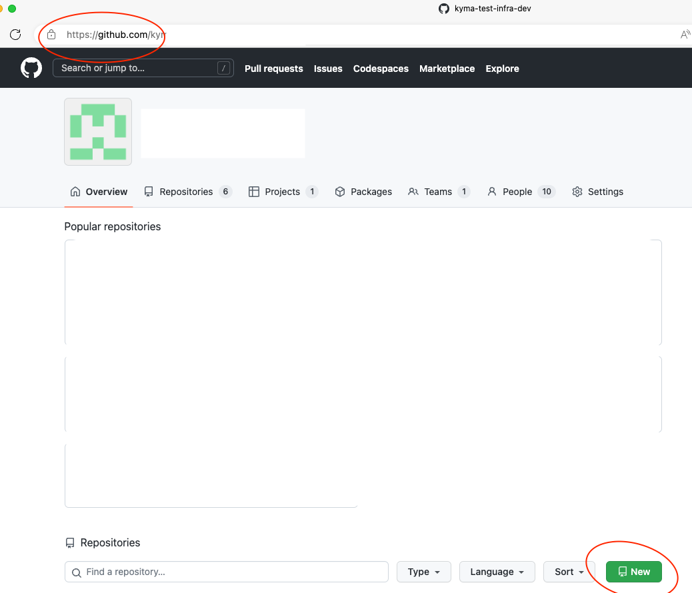
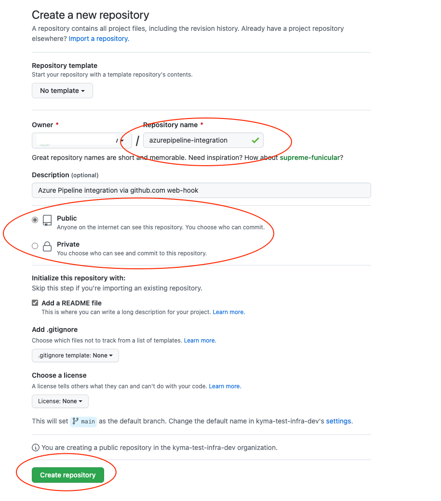
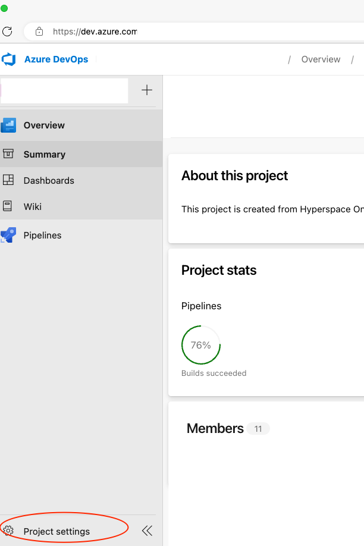
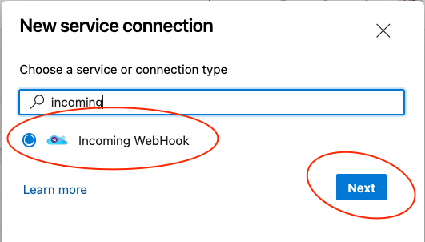

# GitHub.com and Azure Pipeline (ADO) intergation

The basic requirement and motivation was the following:
We have to verify that the integration of an SAP Azure DevopsPipeline as quality gate for a Github.com works.
Expected is to implement a simple AzruDevopsOps pipeline and configure it to become a quality gate for a PR of an public Github.com repository.

- Create two simple Azure Devops Pipeline (one which is always failing and another one which is finishing successfully).
- Create a public Github.com repository
- Configure these two pipelines as quality gate for PRs to this repository (by using Webhooks etc.).
- Open a PR to the repository

## First steps

At first sight the easiest way to do this, to create a Hyperspace based managed pipeline. Unfortunately the **Hyperspace does not support the GitHub.com** related git repository management.

Although we opened a feature request: https://github.tools.sap/hyper-pipe/portal/issues/2303. Finally the responsible team declined our request with the following reason:
"We focus on internal development only. If GH.com would be easily feasible, we'd be happy to also support it. Today it is not in our focus and it also seems not to be so easy. We integrate many internal development tools, some of which are not enabled for GH.com. If GH.com is a strategic investment we would contribute our part as well, but since we integrate only existing solutions, we cannot be front-runners here."

Therefore we started to find another way to establish a stable integration between github.com and Azure Pipeline (Azure DevOps).

## Solution

We have two (2) options to integrate them.

### 1. Create GitHub conection by GitHub PAT (personal access token)

This solution is similar than the Hyperspace related solution on GitHub Enterprise side. This means after the integration the GitHiub side webhook urls configured via a system generated unique identifier depends on PAT. This id's name is **channelId**. (it has a secret which is unknown by us)

- The common format of this url: `https://dev.azure.com/<azure devops organisation>/_apis/public/hooks/externalEvents?publisherId=github&channelId=<system generated unique identifier>&api-version=7.1-preview`

- GitHub side PAT (personal access token) recommended scopes: repo, user, admin:repo_hook
  

Pros:

- Stable connection
- Configured by system
- No additional maintenance

Cons:

- **Unable to parse webhook payload (request body data) in Azure Pipeline**
- You need to manage the GitHub.com side PAT (expiration date - if any)
- You don't know the secret for channelId

### 2. Create Incoming WebHook connection on Azure DevOps side (call a general webhook from GitHub)

The webhook payload (request body data) parsing is mandatory in our scenario, therefore the **option 1 is not our direction** in this usecase.
Luckily we can to use Incoming WebHook connection on Azure Devops side, and we can call this specific url from any webhook ready system such as GitHub.com.
In this way we have chance to parse webhook payload (request body data) in runtime in Azure Pipeline. This method ensures us to execute conditional stages and steps of our pipeline.

In this solution we create a secure connection (Incoming WebHook) on Azure DevOps side and we generate a specific url for this connection. This url is used on GitHub side in WebHook section.

- The common format of this url: `https://dev.azure.com/<organisation>/_apis/public/distributedtask/webhooks/<incoming web hook name>?api-version=7.1-preview`

Pros:

- Stable connection
- **Able to parse webhook payload (request body data) in Azure Pipeline**
- No additional maintenance
- You don't need to manage the GitHub.com side PAT (expiration date - if any)

Cons:

- You need to do some manual steps for establish the connection between GitHub.com and Azure Pipeline

Official documentation: https://learn.microsoft.com/en-us/azure/devops/pipelines/yaml-schema/?view=azure-pipelines

**Accordingly we start to use this method.**

#### **Step-by-step configuration**

##### - GitHub

1. Open https://github.com
2. Login to your account
3. Start to create a new repository

   

4. Enter the name of repo, and choose Public or Private. Then click on Create button

    

##### - Azure DevOps

5. Open [Azure DevOps project](https://dev.azure.com) 

6. Navigate to Project settings

    

7. Select Service connections

    

8. Click on **New service connection** button (top right corner)

    

9. Type `incoming` to search fild to find **Incoming WebHook**, then click Next button

    

When the repository is created, clone it to your computer. For this copy the repository url

    

6. Open your IDE, such as Visual Studio code and start clone the repo (in VS Code: Press F1 then find Git:Clone)

     

7. Then paste the repo url, and hit Enter

     

8. Choose the destination folder for the repo

     

9. When it is download to your computer, you can open it the current window or  a new one

     

10. In the project root directory, create the `azure-pipelines.yml` file. This is the soul of yout pipelinr

     

10. In the project root directory, create the `azure-pipelines.yml` file. This is the soul of yout pipelinr

     

