# GitHub.com and Azure Pipeline (ADO) intergation

The basic requirement and motivation was the following:
We have to verify that the integration of an SAP Azure DevopsPipeline as quality gate for a Github.com works.
Expected is to implement a simple AzruDevopsOps pipeline and configure it to become a quality gate for a PR of a public Github.com repository.

- Create two simple Azure DevOps Pipeline (one which is always failing and another one which is finishing successfully).
- Create a public Github.com repository
- Configure these two pipelines as quality gate for PRs to this repository (by using Webhooks etc.).
- Open a PR to the repository

## First steps

At first sight the easiest way to do this, to create a Hyperspace based managed pipeline. Unfortunately the **Hyperspace does not support the GitHub.com** related git repository management.

Although we opened a feature request: https://github.tools.sap/hyper-pipe/portal/issues/2303. Finally, the responsible team declined our request with the following reason:
"We focus on internal development only. If GH.com would be easily feasible, we'd be happy to also support it. Today it is not in our focus and it also seems not to be so easy. We integrate many internal development tools, some of which are not enabled for GH.com. If GH.com is a strategic investment we would contribute our part as well, but since we integrate only existing solutions, we cannot be front-runners here."

Therefore, we started to find another way to establish a stable integration between github.com and Azure Pipeline (Azure DevOps).

## Solution

We have two (2) options to integrate them.

### 1. Create GitHub conection by GitHub PAT (personal access token)

This solution is similar than the Hyperspace related solution on GitHub Enterprise side. This means after the integration the GitHiub side webhook urls configured via a system generated unique identifier depends on PAT. The id's name is **channelId**. (it has a secret which is unknown by us)

- The common format of this url: `https://dev.azure.com/<azure devops organisation>/_apis/public/hooks/externalEvents?publisherId=github&channelId=<system generated unique identifier>&api-version=7.1-preview`

- GitHub side PAT (personal access token) recommended scopes: repo, user, admin:repo_hook
  

Pros:

- Stable connection
- Configured by system
- No additional maintenance

Cons:

- **Unable to parse webhook payload (request body data) in Azure Pipeline**
- You need to manage the GitHub.com side PAT (expiration date - if any)
- You don't know the secret for channelId

### 2. Create Incoming WebHook connection on Azure DevOps side (call a general webhook from GitHub)

The webhook payload (request body data) parsing is mandatory in our scenario, therefore the **option 1 is not our direction** in this usecase.
Luckily we can to use Incoming WebHook connection on Azure Devops side, and we can call this specific url from any webhook ready system such as GitHub.com.
In this way we have chance to parse webhook payload (request body data) in runtime in Azure Pipeline. This method ensures us to execute conditional stages and steps of our pipeline.

In this solution we create a secure connection (Incoming WebHook) on Azure DevOps side and we generate a specific url for this connection. This url is used on GitHub side in WebHook section.

- The common format of this url: `https://dev.azure.com/<organisation>/_apis/public/distributedtask/webhooks/<incoming web hook name>?api-version=7.1-preview`

Pros:

- Stable connection
- **Able to parse webhook payload (request body data) in Azure Pipeline**
- No additional maintenance
- You don't need to manage the GitHub.com side PAT (expiration date - if any)

Cons:

- You need to do some manual steps for establish the connection between GitHub.com and Azure Pipeline

Official documentation: https://learn.microsoft.com/en-us/azure/devops/pipelines/yaml-schema/?view=azure-pipelines

**Accordingly, we start to use this method.**

#### **Step-by-step configuration**

##### - GitHub

1. Open https://github.com
2. Login to your account
3. Start to create a new repository

   

4. Enter the name of repo, and choose Public or Private. Then click on Create button

   

##### - Azure DevOps

5. Open [Azure DevOps project](https://dev.azure.com)

6. Navigate to Project settings

   

7. Select Service connections

   

8. Click on **New service connection** button (top right corner)

   

9. Type `incoming` to search fild to find **Incoming WebHook**, then click Next button

   

10. Provide the required data on create connection pane, then click Save button

    - WebHook name
    - Secret (For instance generates a 64 character long string with lowercase, uppercase and numbers)
    - Service connection name
    - Check **Grant access permission to all pipelines** under Security

    

##### - Local IDE

11. Our repository is created. Now, clone it to your computer. For this copy the repository url

    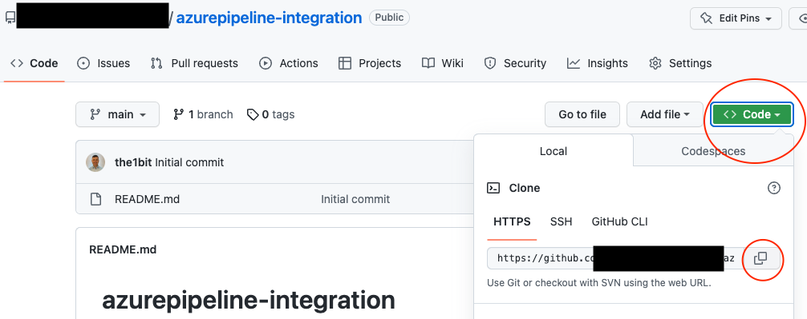

12. Open your IDE, such as Visual Studio code and start clone the repo (in VS Code: Press F1 then find Git:Clone)


13. Then paste the repo url, and hit Enter


14. Choose the destination folder for the repo

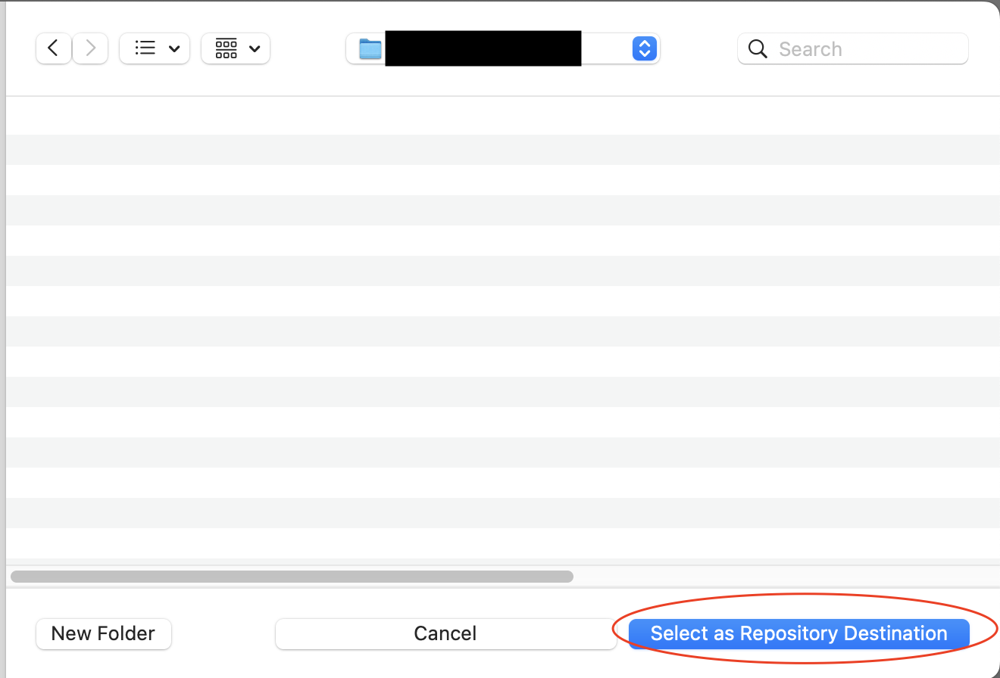

15. When it is download to your computer, you can open it the current window or a new one


16. In the project root directory, create the `azure-pipelines.yml` file. This is the soul of yout pipelinr

    

17. In the project root directory, create the `azure-pipelines.yml` file. This is the soul of your pipeline

    

18. Add the following simple content to `azure-pipelines.yml`. Customize it according to your `Incoming WebHook` connection parameter

Some explanation:
- trigger: **none** (we will manage the execution of the pipeline by the GitHub webhook calls)
- resources.webhooks.webhook: `Incoming WebHook`'s name
- resources.webhooks.connection: `Incoming WebHook`'s service connection name

Also replace the `Incoming WebHook`'s name inside the stages and steps!

```yaml
# Using a general purpose pipeline for Azure
trigger: none

resources:
  webhooks:
    - webhook: githubcomwebhook
      connection: githubconnection

stages:
  - stage: PrerequisiteCheck
    jobs:
      - job: ActionValueCheck
        steps:
          - script: |
              echo 'Action:' ${{ convertToJson(parameters.githubcomwebhook.action) }}
              echo 'Is the Condition reopened, opened, ready_for_review, synchronize?:' ${{ in(parameters.githubcomwebhook.action, 'reopened','opened','ready_for_review','synchronize') }}
```

19. Save the file, and check the right branch before commit and push

    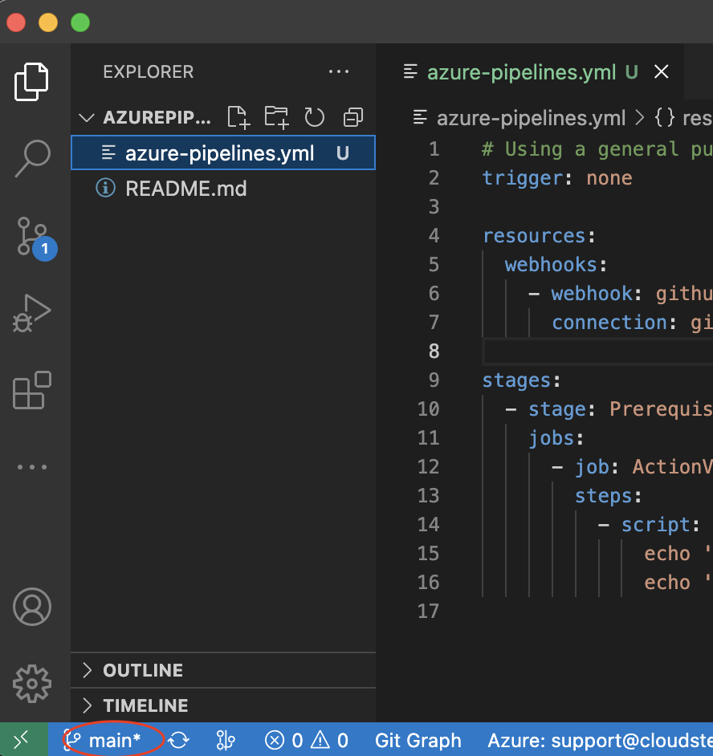

20. After this add to stage changes, commit and push to remote

    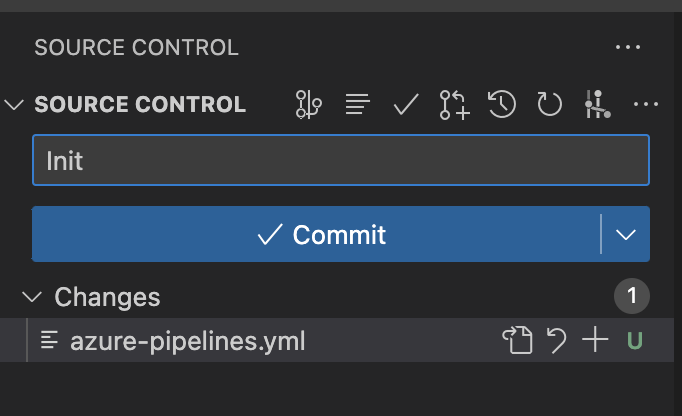

##### - Azure DevOps

21. Back to ADO and start to create pipeline

    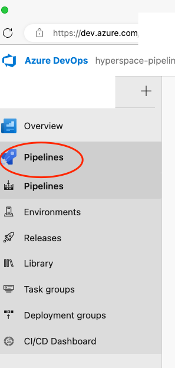

22. Click on **New pipeline** button (top right corner)

    

23. Select **GitHub** as source

    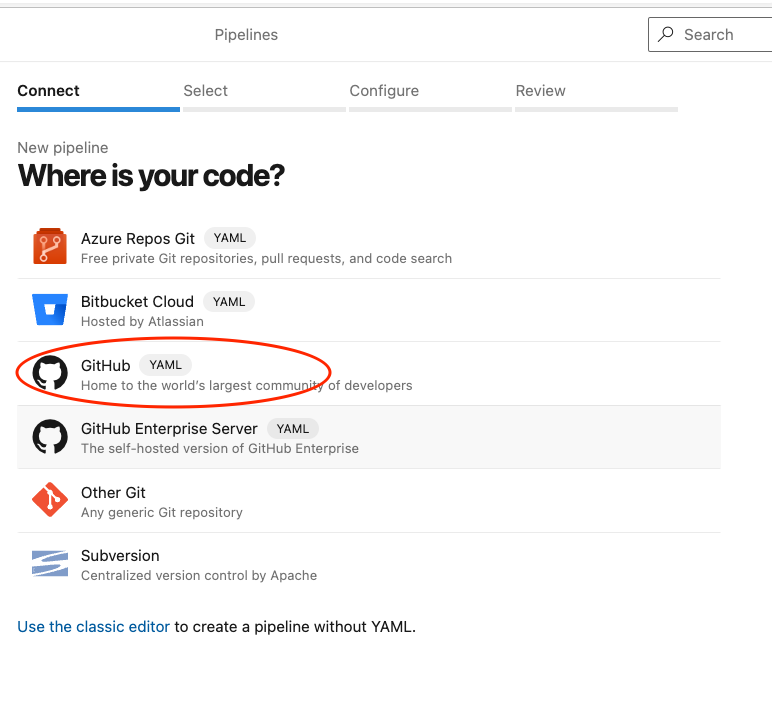

24. Connect to GitHub if necessary, then end of fielter field select **All repositories** and type your repo name in ther filter field.

    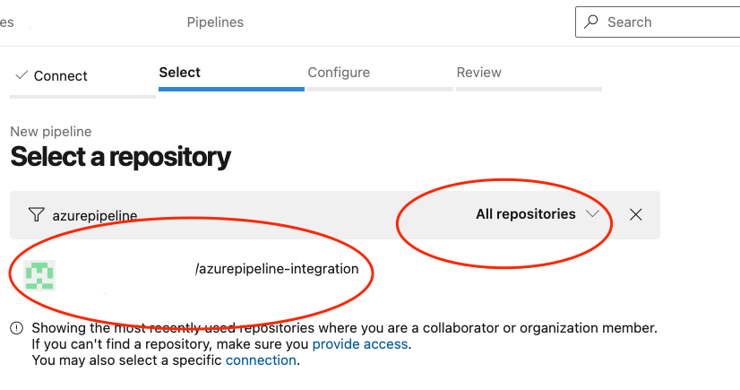

25. Select the repo, then choose the existing yaml file (`azure-pipelines.yml`) in then next step and continue

26. In review step, you can check the yaml file content before you create the pipeline

    

27. Choose the **Save** option under the Run dropdown to save the pipeline

    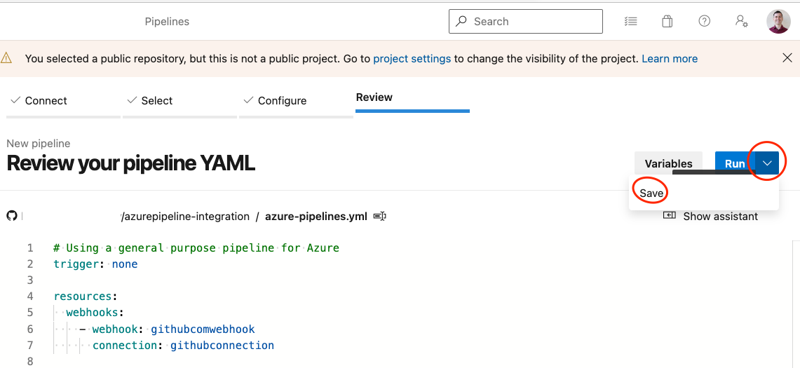

28. Pipeline is ready for run

    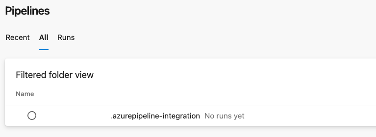

Let's configure the GitHub side webhook.

##### - GitHub

29. Go to you repositorym and click Settings option

    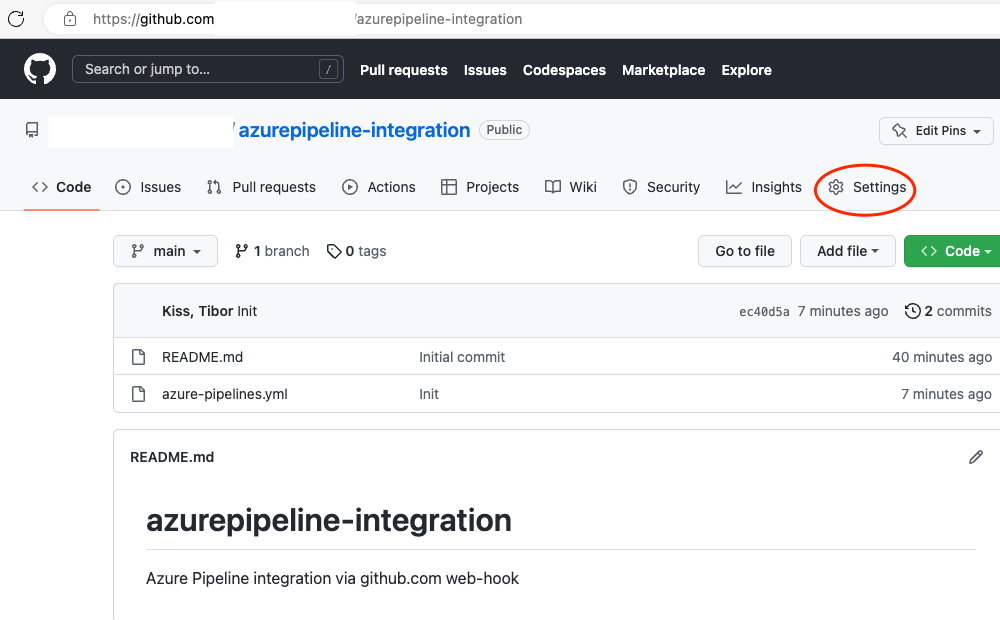

30. If you have pull_request related webhook, start to edit that. If you don't have webhook, click on **Add webhook** button

    

31. Provide the required data, then click **Add webhook / Update webhook** button

Some explanation:

- Payload URL: Configure the following URL according to your Azure DevOps related **Organisation** and **Incoming WebHook name** - `https://dev.azure.com/<organisation>/_apis/public/distributedtask/webhooks/<incoming web hook name>?api-version=7.1-preview`
- Content type: `application/json`
- Secret: Secret you used in **Incoming WebHook** connection
- Enable SSL verification
- Which events would you like to trigger this webhook?: Select `Let me select individual events`, then scroll down to check `Pull requests`

    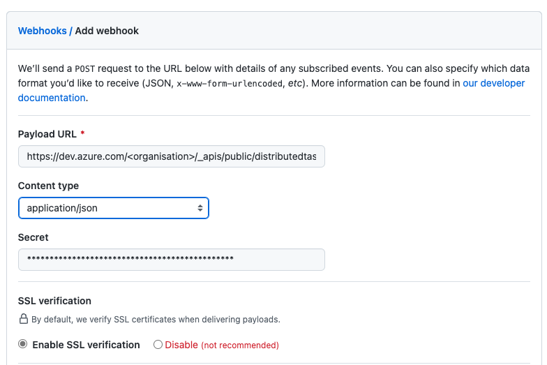
    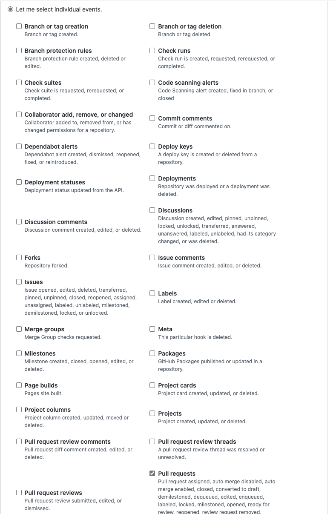
    

32. Click on **Recent Deliveres** tab, and check the ping request (which makes a health check)

    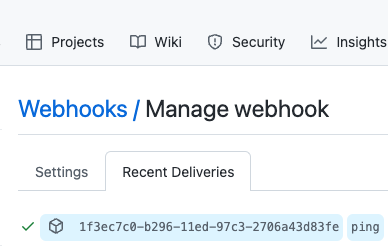

Pipeline configuration is done. :-)

##### - Local IDE

33. To check the pipeline, go back to yor IDE, and create a new branch (eg.: featurebranch). Make some code change, maybe ion README.md file. Then push the changes to GitHub.

34. Open your GitHub repo in your browser and start a pull request

    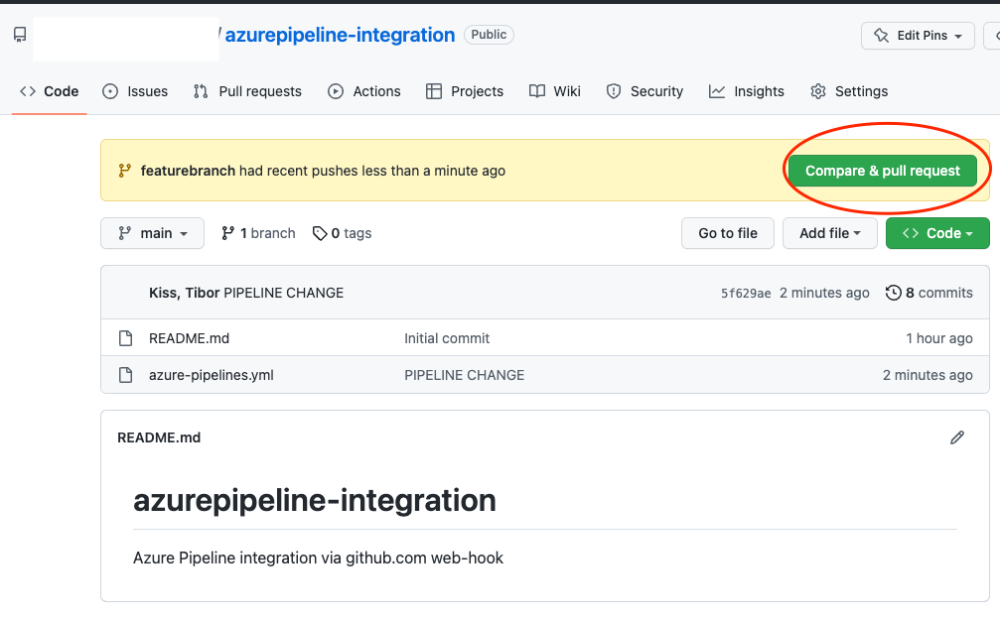

35. When the pull request opened (eg.: waiting for review) the GitHub will start a wehbook call. Then the pull request is closed there will be anither webhook call. Accordingly, there must be 2 webhook calls. 

- 35.1. GitHub side `Recent Deliveries`:

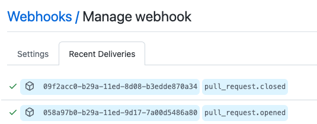


- 35.2. Azure DevOps side `Runs`:

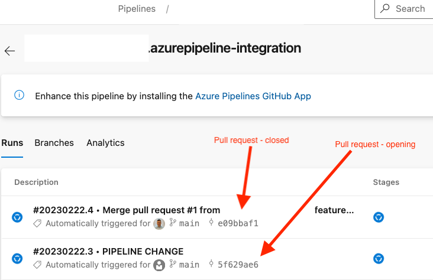

    Check payload parsing:


